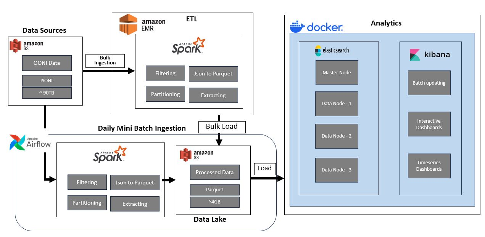
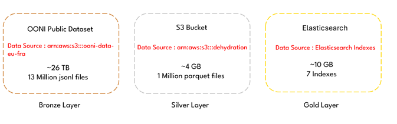
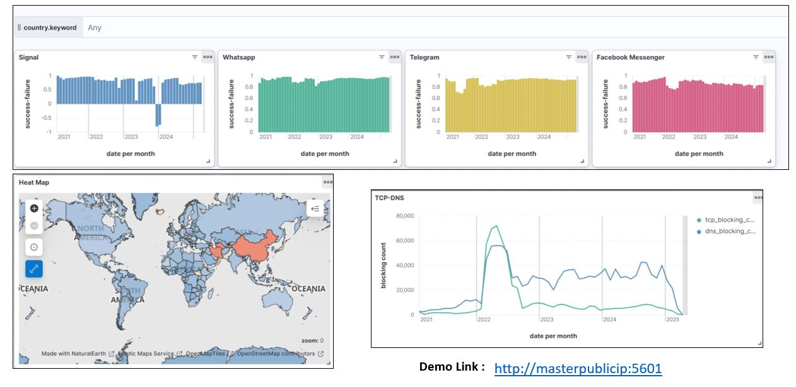
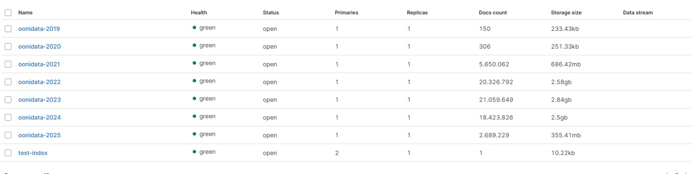
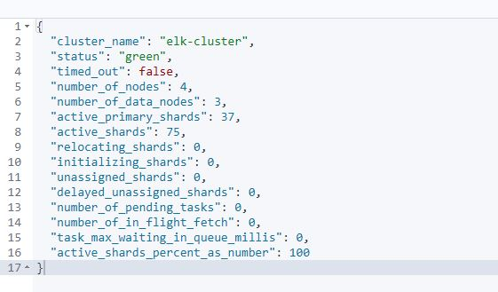
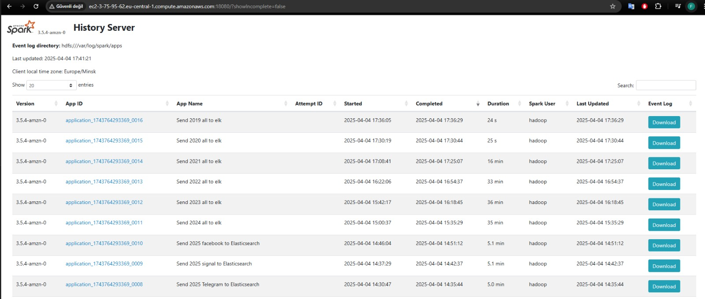
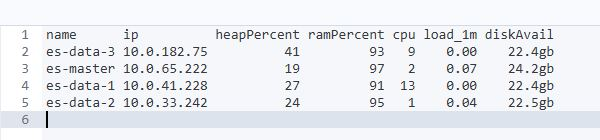
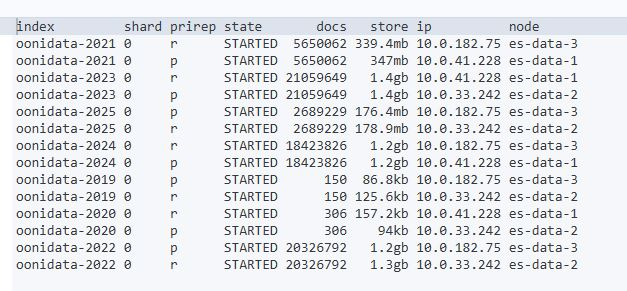

#  Big Data Pipeline for Global Internet Censorship Analysis

This project analyzes global censorship trends targeting communication platforms (e.g., WhatsApp, Telegram, Signal, Facebook Messenger) using OONI's 90TB dataset. We built a scalable big data pipeline using Spark, AWS, Elasticsearch, and Airflow.

---

##  Prerequisites

Before running this pipeline, make sure you have the necessary infrastructure and tools set up. You can follow our public guides below:

-  **Big Data & AI Installation (Spark, EMR, Airflow, etc.):**  
  [https://github.com/Furkaragoz/big-data-ai-installation](https://github.com/Furkaragoz/big-data-ai-installation)

-  **Elasticsearch Cluster Deployment with Docker on AWS EC2:**  
  [https://github.com/Furkaragoz/elasticsearch-cluster-installation](https://github.com/Furkaragoz/elasticsearch-cluster-installation)

---

##  Architecture Overview

We designed a distributed architecture to efficiently process, transform, and visualize OONI data.



- **Apache Spark on EMR**: Parallel processing of large `.jsonl.gz` files.
- **Amazon S3**: Stores filtered and processed data (~4GB in Parquet).
- **Elasticsearch + Kibana**: Enables search, aggregation, and interactive dashboards.
- **Apache Airflow**: Triggers daily updates at 04:00 UTC.

---

##  Processing Pipeline Summary

- Extract metadata to avoid S3 file listing bottleneck.
- Filter and normalize JSONL structure using predefined schema.
- Repartition to ~128MB Parquet files.
- Index into Elasticsearch by country, app, date.

**Medallion Architecture:**



---

##  Failure Analysis

Censorship indicators observed in OONI data:

| Error Type            | Description                              |
|-----------------------|------------------------------------------|
| dns_nxdomain_error    | DNS-level blocking via fake NXDOMAIN     |
| connection_reset      | TCP reset injection by middleboxes       |
| ssl_unknown_authority | MitM attempts with fake SSL certs        |
| timeout / refused     | Indicates throttling or IP filtering     |

---

##  Visualizations

We built an interactive dashboard for censorship analytics.



**Highlights:**
-  Signal shows sharp drop in accessibility post-2023  
-  WhatsApp remains mostly unaffected  
-  Heatmap shows global blocking activity  
-  TCP blocking peaked in 2022; DNS blocking remained persistent  

---

##  Elasticsearch Index Stats




Cluster Status:
- 4 Nodes (1 master, 3 data)
- 7 indexes (2019–2025)
- ~10GB total indexed data

---

##  Resource Monitoring

### Spark EMR Jobs  


### Node Usage  


### Data Distribution  


---

##  Technologies Used

- **Apache Spark 3.5.4** on **AWS EMR**
- **Amazon S3** for storage
- **Apache Airflow** for orchestration
- **Elasticsearch + Kibana 8.12** for analytics
- **Docker** for ELK deployment

---

## Live Demo

Access Kibana dashboards:  
 [http://masterpublicip:5601](http://masterpublicip:5601)

---

##  Running on EMR with Spark Submit

After launching your **EMR cluster** with Spark and setting up required permissions (IAM roles, S3 access, network config, etc.), you can run any of the ingestion scripts using the following command:

```bash
spark-submit \
  --master yarn \
  --deploy-mode client \
  --name Send2023facebookToES \
  --jars s3://dehydration/jars/elasticsearch-spark-30_2.12-8.12.2.jar \
  --conf spark.hadoop.fs.s3a.path.style.access=true \
  --conf spark.hadoop.fs.s3a.connection.ssl.enabled=true \
  --conf spark.sql.sources.partitionOverwriteMode=dynamic \
  --conf spark.serializer=org.apache.spark.serializer.JavaSerializer \
  scripts/s3_to_elasticsearch.py
```

###  Explanation of Flags

- `--jars`: Path to the Elasticsearch connector JAR file in your S3 bucket.
- `--conf`: Custom Spark and Hadoop settings for S3 and Elasticsearch compatibility.
- `--name`: Job identifier to help track the execution in EMR/YARN UI.
- `scripts/s3_to_elasticsearch.py`: Path to the Spark job script. You can replace this with any of the application-specific ingestion scripts below.

---

###  Script Options

You can use any of the following Python scripts based on the application:

- `scripts/whatsapp_bulk_ingestion.py`
- `scripts/telegram_bulk_ingestion.py`
- `scripts/signal_bulk_ingestion.py`
- `scripts/facebook_bulk_ingestion.py`

---

###  Requirements to run

- The script must be either:
  - Uploaded to the EMR master node, **or**
  - Stored in S3 and downloaded before execution.
  
- Your Elasticsearch cluster must be:
  - Publicly accessible, **or**
  - Within the same VPC/subnet group as your EMR cluster (with security group rules configured).

This method allows you to run data transfer jobs from Amazon S3 to Elasticsearch either manually or as part of an automated pipeline (e.g., via Airflow).
